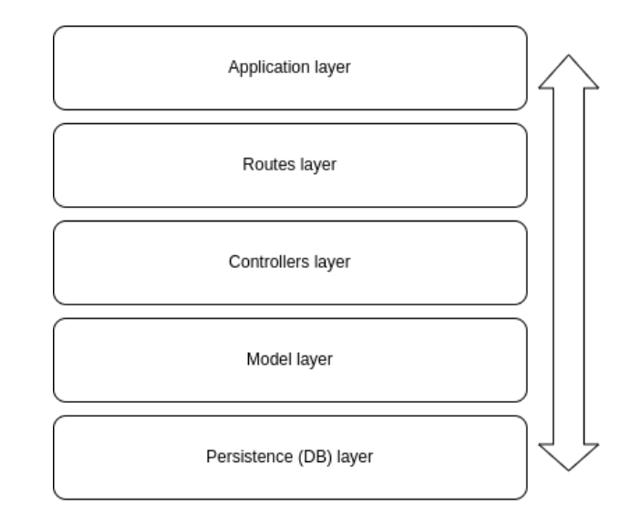

Copied from Article at: https://www.freecodecamp.org/news/build-consume-and-document-a-rest-api/

## The REST API Handbook – How to Build, Test, Consume, and Document REST APIs

Table of Contents:

- What is REST?
- How to Build a REST API with Node and Express
- How to Test a REST API with Supertest
- How to Consume a REST API on a Front-end React App
- How to Document a REST API with Swagger
- Wrapping up

### What is REST?

Representational State Transfer (REST) is a widely used architectural style for building web services and APIs.

RESTful APIs are designed to be simple, scalable, and flexible. They are often used in web and mobile applications, as well as in Internet of Things (IoT) and microservices architectures.

### Main Characteristics:

- Stateless: REST APIs are stateless, which means that each request contains all the necessary information to process it. This makes it easier to scale the API and improves performance by reducing the need to store and manage session data on the server.
- Resource-based: REST APIs are resource-based, which means that each resource is identified by a unique URI (Uniform Resource Identifier) and can be accessed using standard HTTP methods such as GET, POST, PUT, and DELETE.
- Uniform Interface: REST APIs have a uniform interface that allows clients to interact with resources using a standardized set of methods and response formats. This makes it easier for developers to build and maintain APIs, and for clients to consume them.
- Cacheable: REST APIs are cacheable, which means that responses can be cached to improve performance and reduce network traffic.
- Layered System: REST APIs are designed to be layered, which means that intermediaries such as proxies and gateways can be added between the client and server without affecting the overall system.

### Pros of REST APIs:

- Easy to learn and use: REST APIs are relatively simple and easy to learn compared to other APIs.
- Scalability: The stateless nature of REST APIs makes them highly scalable and efficient.
- Flexibility: REST APIs are flexible and can be used to build a wide range of applications and systems.
- Wide support: REST APIs are widely supported by development tools and frameworks, making it easy to integrate them into existing systems.

### Cons of REST APIs:

- Lack of standards: The lack of strict standards for REST APIs can lead to inconsistencies and interoperability issues.
- Limited functionality: REST APIs are designed to handle simple requests and responses and may not be suitable for more complex use cases.
- Security concerns: REST APIs can be vulnerable to security attacks such as cross-site scripting (XSS) and cross-site request forgery (CSRF) if not implemented properly.

### REST APIs are best for:

REST APIs are well-suited for building web and mobile applications, as well as microservices architectures and IoT systems.
They are particularly useful in situations where scalability and flexibility are important, and where developers need to integrate with existing systems and technologies.
In summary, REST APIs are a popular and widely used architectural style for building web services and APIs. They are simple, scalable, and flexible, and can be used to build a wide range of applications and systems.

While there are some limitations and concerns with REST APIs, they remain a popular and effective option for building APIs in many different industries and sectors.

## Our architecture

For this project we'll follow a layers architecture in our codebase. Layers architecture is about dividing concerns and responsibilities into different folders and files, and allowing direct communication only between certain folders and files.

- The application layer will have the basic setup of our server and the connection to our routes (the next layer).
- The routes layer will have the definition of all of our routes and the connection to the controllers (the next layer).
- The controllers layer will have the actual logic we want to perform in each of our endpoints and the connection to the model layer (the next layer, you get the idea...)
- The model layer will hold the logic for interacting with our mock database.
- Finally, the persistence layer is where our database will be.

An important thing to keep in mind is that in these kinds of architectures, there's a defined communication flow between the layers that has to be followed for it to make sense.

This means that a request first has to go through the first layer, then the second, then the third and so on. No request should skip layers because that would mess with the logic of the architecture and the benefits of organization and modularity it gives us.
